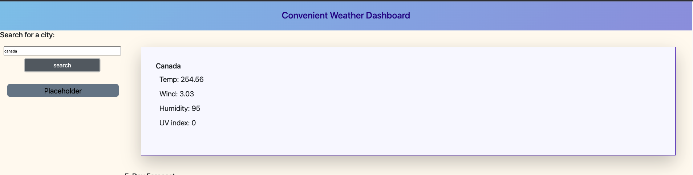

# convenient-weather-dashboard

The most convenient places to get weather information from the best APIs.



## Description

Convenient Weather Dashboard is your to-go place to know where to get the current weather information of any location of
your choosing.

## Usage

Type the name of any city of country click the search button and you will receive the latest weather information
available.

## Installation

You can clone the project from the [repository](https://github.com/JanInquisitor/convenient-weather-dashboard).

```
git clone https://github.com/JanInquisitor/convenient-weather-dashboard
```

## Contributing

Anyone is welcome to contribute to this project.

## License

See the [LICENSE](https://www.google.com/) file for information.


